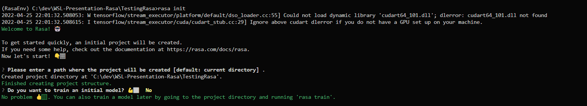
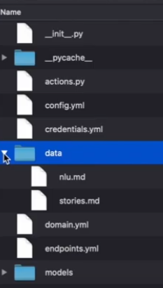

# RASA_Edubot

## Creation of Env
```
conda create --name RasaEnvFinal python==3.7
conda activate RasaEnvFinal
```

## How to install Rasa

```
conda install tensorflow==2.1.0
pip install rasa[spacy]==1.8.0
python -m spacy download en_core_web_md
```

## Debugging Steps

>Note: The above steps requires Python 3.7 or 3.8
If there are some spacy errors try to upgrade your pip and run again.

### **With Linux**:

You can skip the **first step** in linux sometimes if it is showing an already existing `unoverwritable error`

### **General**:

You can try this command if the above rasa installation for spacy is not working
```
pip install spacy
```

Sometimes your sdk version and core verisons are different. So in such cases just reinstall the sdk to the correct core version using the below command.

```
pip install rasa-sdk~=1.8.0
```

## Creating the Initial Project
To create an initial Rasa Project type the command:
```
rasa init
```
This will create a base Happy/Sad Chatbot Conversational AI for you which then you can update according to your needs



## Explaining the Directory Structure
Now Rasa takes a completely different approach to dialogue management, instead of creating rules and enforcing them like traditional chatbots, it uses ML to learn the conversational patterns, from the example data(in the NLU files), and predicts how the assistant should respond in a specific situation, history, etc.

 <p style="float:left">
    
    <p>
        Data:- This folder contains all NLU and STORIES files. <br><br>
        <strong>NLU</strong> stands for Natural language Understanding this file in Naive language contains your Natural language Data on which Rasa will train. NLU file ( nlu.yml) contains categories such as Intents and Entities, which were explained in the slides.
        <br><br>
        Next comes the pipeline which tells Rasa on how to learn from these intents and Entities which is specified inside the <strong> config.yml </strong>
        <br><br>
        The component responsible for managing this situation and contextual data is written inside the stories.md file, where we write different ways in which a conversation between a user and a bot might go.
        <br><br>
        <strong>Domain file</strong> this is the universe of your chatbot. It contains all the intent’s you want to train on and all the utters ( responses ) for each intent and some other important data like slots which remain stored throughout the duration of a talk.
        <br><br>
        Finally, one most important file is the <strong>actions.py</strong> file which is where we will write our custom actions(response) to particular queries. Ex: Maybe finding the definition of a word when queried for it.
        <br><br>
        Lastly <strong>Credentials.yml and endpoints.yml</strong> are not that importnat files, in general Credentials.yml is use to connect to rasa-x which is a web based version of the chatbot and endpoints.yml is used to tell Rasa on which endpoint the Rasa Actions server is running.
    </p>
 </p>

## For training
To train your Rasa model you have 2 options:
1. You want to train just you NLU classifier files. For this you can run the command shown below.
```
rasa train nlu
```
2. If you want to train your entire chatbot including the pathways/stories and responses and your custom actions, then you can run this command inside:
```
rasa train
```
Both of the above commands generate a model inside the `models/` directory.

## For inferencing

For inferencing the model again there are 2 methods that you can utilize:
1. To infer about the NLU intent and entity classification, you can run:
```
rasa shell nlu
```
which would give you responses which look something like shown below. <br>

2. To run an entire simulation of your entire chatbot, you can run:
```
rasa shell
```

This would run a shell version of you `entire rasa chatbot`.


## For Frontend
